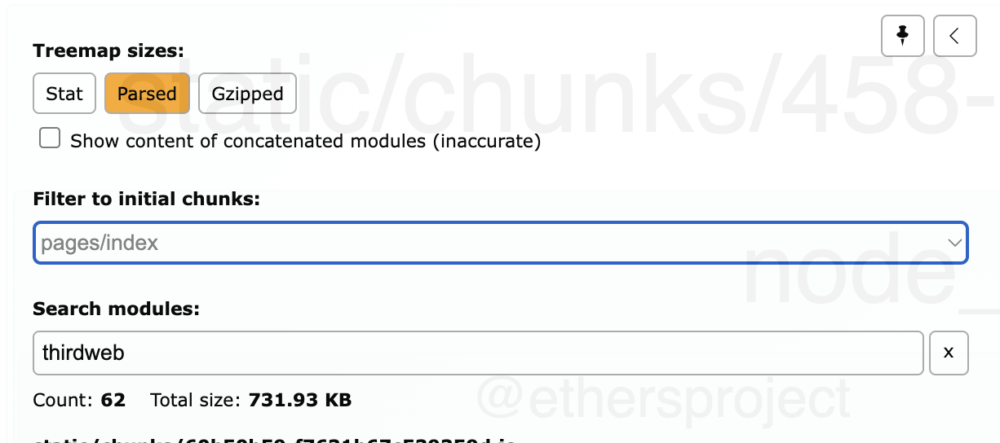

# thirdweb-sdk tree shaking issue (Next.js)

There's something wrong with how the exports are done in thirdweb-sdk which causes the treeshaking to not work properly.

## Install dependencies

```bash
npm install
```

## Create a Build + Analyze

```bash
npm run build:analyze
```

- 3 files will open up in the browser
- View the client.html

<br/>

## Using the Analyzer

- Click on Parsed Size
- Select pages/index chunk
- search for `thirdweb`
- view the output


